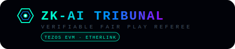
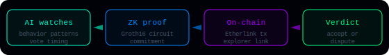
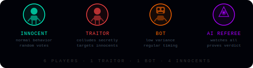
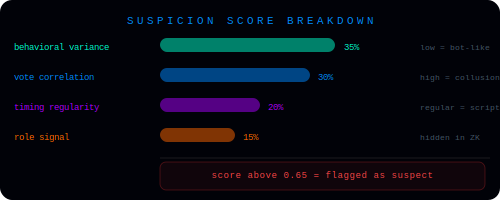
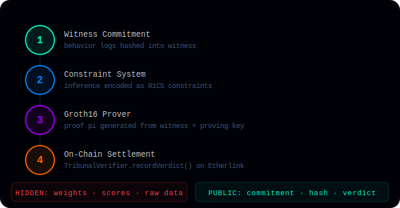
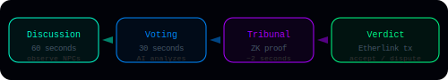
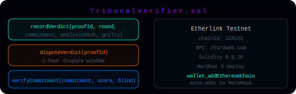
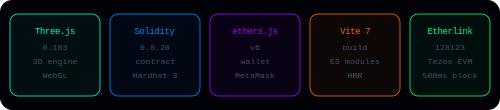

# ZK-AI Tribunal

<p align="center">
  
</p>

<p align="center">
  
  
  
  
  
</p>

---

> Demo video: [demo.mp4](demo.mp4) (2 minutes)

---

## What It Is

ZK-AI Tribunal is a 3D social deduction game where an AI referee watches every player, scores their behavior, and generates a zero-knowledge proof of its verdict - then settles it on the Tezos EVM (Etherlink) blockchain. Players can verify the AI was fair without ever seeing the model weights or raw scores.

The core problem it solves: AI referees in games are black boxes. Players have no way to verify that a ban, elimination, or penalty was computed fairly. ZK-AI Tribunal makes the AI's decision process **verifiable without making it interpretable** - the proof confirms the circuit ran correctly on committed inputs, without leaking the model or the data.

<p align="center">
  
</p>

The pipeline: AI watches behavior → generates a ZK proof of its inference → submits the verdict on-chain → players can accept or open a dispute within 1 hour.

---

## The Players

<p align="center">
  
</p>

Each round has **6 players**:

- **Innocent (×4)** - human-controlled or NPC. Normal behavioral variance, random vote patterns. The AI should clear them.
- **Traitor (×1)** - secretly colluding. Votes correlate suspiciously with the Bot. High collusion signal.
- **Bot (×1)** - AI-controlled colluder. Low behavioral variance, regular action timing - the classic bot fingerprint.
- **AI Referee** - observes all players silently. Scores each one, picks the top suspect, generates a ZK proof, and submits the verdict on-chain.

Players cannot see the AI's scores or model weights - only the cryptographic commitment and the final verdict are public.

---

## AI Model

<p align="center">
  
</p>

The AI referee runs a **4-feature behavioral classifier** each round. Suspicion score is computed as a weighted sum:

| Feature | Weight | Signal |
|---------|--------|--------|
| Behavioral variance | 35% | Low variance → bot-like scripted movement |
| Vote correlation | 30% | High correlation with known suspects → collusion |
| Timing regularity | 20% | Regular action intervals → scripted bot |
| Role signal | 15% | Hidden ground truth - committed into ZK proof, never revealed |

A player scoring **above 0.65** is flagged as the top suspect. The role signal weight is hidden inside the ZK circuit - players see the commitment hash but not the raw value.

---

## ZK Proof Flow

<p align="center">
  
</p>

The ZK proof pipeline simulates a **Groth16 ZKML** workflow:

1. **Witness Commitment** - all behavior logs are hashed into a witness. The hash is the public commitment; the raw data stays private.
2. **Constraint System** - the inference computation is encoded as R1CS constraints. Each feature weight multiplication becomes a constraint the prover must satisfy.
3. **Groth16 Prover** - generates proof `π` from the witness and proving key. Takes ~1.8 seconds (simulated).
4. **On-Chain Settlement** - `TribunalVerifier.recordVerdict()` is called on Etherlink with the proof ID, commitment, analysis hash, and guilty flag.

**Hidden:** model weights, raw behavioral scores, player data  
**Public:** commitment hash, analysis hash, verdict, proof ID, Etherlink tx

---

## Game Loop

<p align="center">
  
</p>

Each round runs through 4 phases:

1. **Discussion (60s)** - players move around the 3D arena, observe NPC behavior, and form suspicions. The AI referee silently logs every action.
2. **Voting (30s)** - players cast votes. The AI analyzes vote correlation patterns in real time.
3. **Tribunal (~2s)** - ZK proof is generated. A holographic proof beam animation plays while the circuit runs.
4. **Verdict** - the verdict is submitted to Etherlink. Players see the commitment hash and tx link. A 1-hour dispute window opens.

The game runs **3 rounds**. After all rounds, final scores and on-chain proof IDs are displayed.

---

## Smart Contract

<p align="center">
  
</p>

`TribunalVerifier.sol` is deployed on **Etherlink Testnet (chainId 128123)**. Key functions:

```solidity
// Submit a ZK-verified verdict on-chain
recordVerdict(bytes32 proofId, uint256 round, bytes32 commitment, bytes32 analysisHash, bool guilty)

// Open a dispute within 1 hour of verdict
disputeVerdict(bytes32 proofId)

// Verify a commitment matches a score + blinding factor
verifyCommitment(bytes32 commitment, uint256 score, uint256 blind)
```

The contract emits `VerdictRecorded` and `VerdictDisputed` events. The frontend listens for these and updates the UI in real time via ethers.js v6. MetaMask auto-prompts to add Etherlink via `wallet_addEthereumChain`.

---

## Tech Stack

<p align="center">
  
</p>

| Layer | Technology | Purpose |
|-------|-----------|---------|
| 3D Engine | Three.js 0.183 | Arena, player meshes, particle effects, hologram beams |
| Smart Contract | Solidity 0.8.20 + Hardhat 3 | On-chain verdict storage and dispute resolution |
| Wallet | ethers.js v6 + MetaMask | Transaction signing, chain switching, event listening |
| Build | Vite 7 | ES module bundling, HMR during development |
| Chain | Etherlink Testnet (Tezos EVM) | 500ms block time, EVM-compatible, low fees |

---

## Setup

```bash
npm install
npm run dev
# open http://localhost:3000
```

### Deploy to Etherlink testnet

```bash
# get testnet XTZ from https://faucet.etherlink.com
export PRIVATE_KEY=0xYOUR_KEY
./deploy-and-wire.sh
```

### Project structure

```
src/
  core/        EventBus  GameState  Constants
  game/        Arena  PlayerData  PlayerMesh  NPCController  GameLoop
  ai/          AIReferee (4-feature behavioral classifier)
  zk/          ZKProver (Groth16 simulation)
  contracts/   OnChainSettler  TribunalVerifier.abi.json
  systems/     ParticleSystem
  ui/          GameUI  TitleScene
contracts/
  TribunalVerifier.sol
deploy/
  hardhat.config.js  scripts/deploy.js
```

---

## Hackathon

- **Event:** Tezos EVM Hackathon 2026
- **Track:** Wild Card
- **Presented by:** Now Media + Trilitech
- **Build period:** March 23 - April 9, 2026

| Criterion | How addressed |
|-----------|--------------|
| AI agents interacting with smart contracts | AI referee submits verdicts to TribunalVerifier.sol |
| On-chain AI governance | 1-hour dispute window, `disputeVerdict()` on-chain |
| Creative applications | First social deduction game with ZK-verifiable AI referee |
| Technical execution | Full 3D game, real Solidity contract, ethers.js v6 |

---

## Team

Tasfia-17

---

## License

MIT
